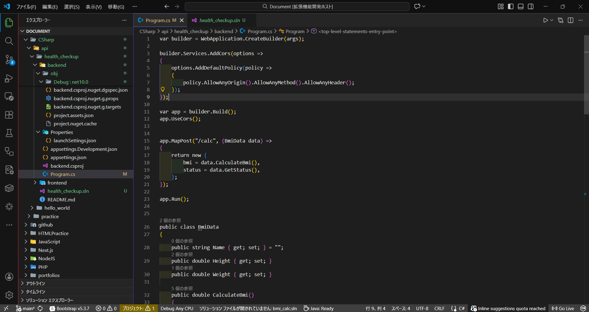

# Vivid Simple Modern Theme

A high-visibility VS Code theme designed to bridge the gap between browser-heavy workflows and intense coding sessions.

## 🌟 Key Features

- **Seamless Migration from Dark Modern**: Built upon the foundation of VS Code's standard 'Dark Modern'. You can switch to this theme without any learning curve or visual discomfort.
- **Improved Tab & UI Visibility**: Distinct boundaries around tabs and activity bars make it instantly clear which file is active, even in multi-window or browser-heavy workflows.
- **Vivid Logic Boundaries**: 
  - **Vivid Red**: Clearly marks the Activity Bar edge.
  - **Cool Blue**: Defines the Sidebar and Active Indent guides.
- **Professional & Clean**: While adding vital visual cues, headers and text remain in classic professional white/gray to keep your focus on the code.

## 🛠 Installation

Currently available via VSIX:

1. Download the `.vsix` file from the [Releases](https://github.com/fujitashuichi/vivid-simple-modern-theme/releases) page.
2. Open VS Code.
3. Go to the Extensions view (`Ctrl+Shift+X`).
4. Click the `...` (top right) and select **Install from VSIX...**.
5. Select the downloaded file.
6. Set the theme:
     1. settings (Ctl + ,)
     2. search "theme"
     3. Workbench: Color Theme
     4. select "Vivid Simple Dark Modern"

---
Enjoy a more vivid and simpler coding experience!
